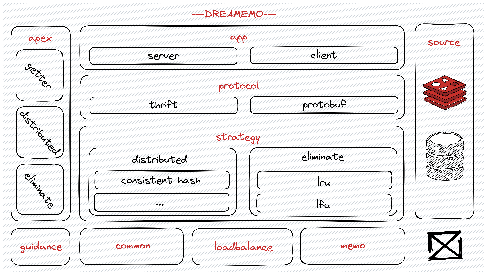

# DREAMEMO

> You Can (Not) Escape


DREAMEMO is a distributed cache with out-of-the-box, high-scalability, modular-design features.

## Architecture



## Install

```shell
go get github.com/B1NARY-GR0UP/dreamemo
```

## Quick Start

### Standalone

[example](examples/standalone/main.go)

### Cluster

[example](examples/cluster/main.go)

### Custom Assemble

[example](examples/assemble/main.go)

## Related Projects

- [PIANO](https://github.com/B1NARY-GR0UP/piano) | A simple and lightweight HTTP framework. More features will be supported gradually. | `golang` `http`
- [INQUISITOR](https://github.com/B1NARY-GR0UP/inquisitor) | A simple and lightweight log. | `golang` `log`

## Blogs

- [DREAMEMO: An out-of-the-box, high-scalability, modular-design distributed cache](https://dev.to/justlorain/dreamemo-an-out-of-the-box-high-scalability-modular-design-distributed-cache-4d6e)

## License

DREAMEMO is distributed under the [Apache License 2.0](./LICENSE). The licenses of third party dependencies of DREAMEMO are explained [here](./licenses).

## End

DREAMEMO is a subproject of the [BINARY WEB ECOLOGY](https://github.com/B1NARY-GR0UP)