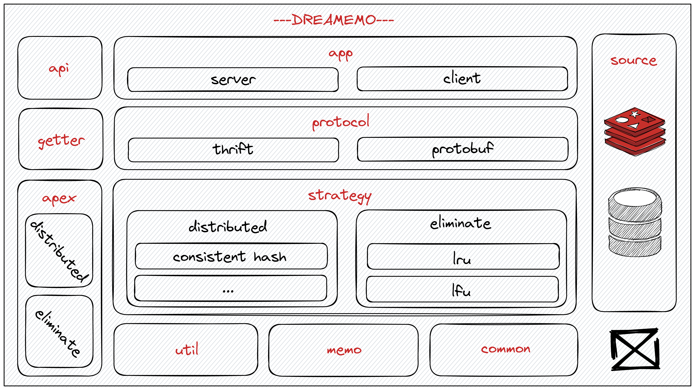

# DREAMEMO

> You Can (Not) Escape


DREAMEMO is a distributed cache with out-of-the-box, high-scalability, modular-design features.

## Architecture



## Quick Start

[example](./example/helloworld)

```go
package main

import (
	"github.com/B1NARY-GR0UP/dreamemo/dream"
)

func main() {
	dream.Default()
}
```

## End

DREAMEMO is a subproject of the [BINARY WEB ECOLOGY](https://github.com/B1NARY-GR0UP)